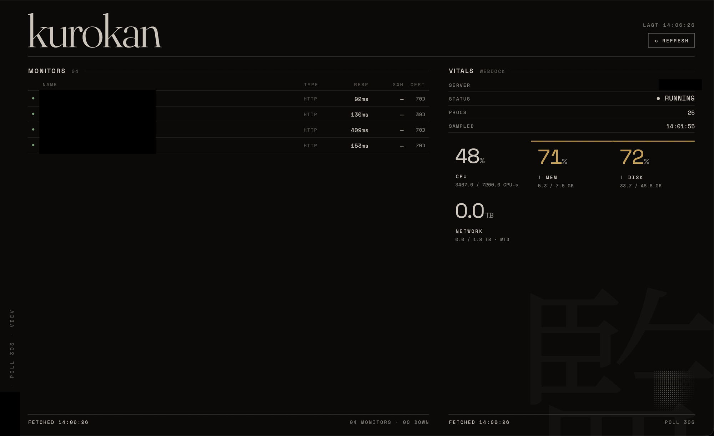

# Kurokan (黒監)

A single-window Flutter desktop dashboard that polls Uptime Kuma and
Webdock.io read-only on an interval, replacing two daily browser tabs.
Swiss-Japanese monochrome design, with color reserved for status: green/red
monitor dots, amber/red vitals tiles. macOS first, Linux (CachyOS, GTK)
second.



## Features

- Live Uptime Kuma monitor list (status, response time, 24h uptime, cert
  expiry) via the Prometheus `/metrics` endpoint
- Live Webdock VPS vitals (CPU, memory, disk, network) with threshold-based
  color accents
- Six-state per-panel model (loading/refreshing/stale/error/fresh) so a
  down source dims and shows its last-known-good data instead of going blank
- Config file watcher: edit `config.json`, the dashboard reloads live, no
  relaunch
- No plugins, no tray, no telemetry — reads two read-only APIs on an
  interval and nothing else

See `docs/PLAN.md` for the full implementation plan and `docs/DECISIONS.md`
for the decisions log.

## Getting started

```
cp /path/to/config.json ~/.config/kurokan/config.json   # see docs/PLAN.md section 5 for the shape
make run
make test
make install-macos   # release build, copies Kurokan.app to /Applications
```
